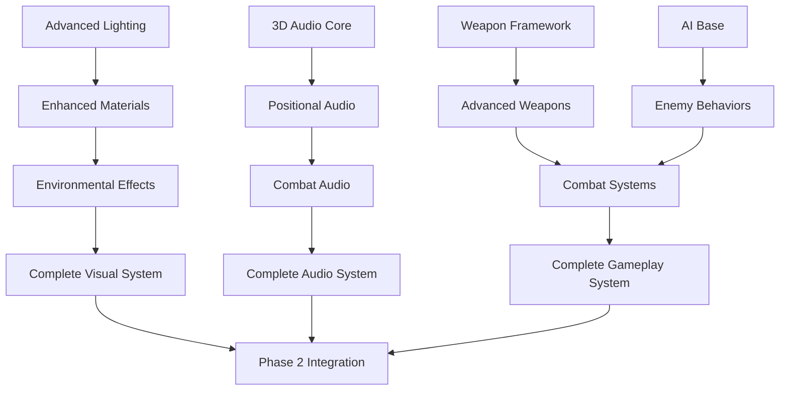

# Transition Guide for Phase 2
## From 3D Foundation to Enhanced Features

**Guide Version**: 1.0  
**Created**: August 21, 2025  
**Target Audience**: Development Team  
**Purpose**: Smooth transition from Phase 1 to Phase 2 development

---

## Overview

This guide provides detailed instructions for transitioning from the completed Phase 1 3D foundation to Phase 2 enhanced features development. It covers environment setup, codebase preparation, team coordination, and development workflow establishment.

---

## 1. Pre-Phase 2 Checklist

### 1.1 Phase 1 Completion Verification

Before beginning Phase 2, verify all Phase 1 deliverables are complete and stable:

```bash
# Build verification
dotnet build --configuration Release
dotnet test --configuration Release

# Performance verification
dotnet run --project Asteroids/tests/Phase1TestRunner.cs

# Code quality check
dotnet format --verify-no-changes
```

#### **Required Completions** ✅
- [ ] All 3D foundation systems operational
- [ ] Performance benchmarks met (100K+ collision ops/sec)
- [ ] Integration tests passing (100% success rate)
- [ ] Documentation complete and up-to-date
- [ ] Build system stable and reliable
- [ ] Version control clean (no uncommitted changes)

### 1.2 Environment Preparation

#### **Development Environment Setup**
```bash
# Update to latest .NET version if needed
dotnet --version  # Should be 8.0+

# Update NuGet packages to resolve security warnings
dotnet list package --outdated
dotnet add package System.Text.Json --version 8.0.5

# Install additional development tools
dotnet tool install --global dotnet-trace
dotnet tool install --global dotnet-dump
dotnet tool install --global dotnet-counters
```

#### **IDE Configuration**
```xml
<!-- .editorconfig updates for Phase 2 -->
[*.cs]
dotnet_analyzer_diagnostic.category-performance.severity = warning
dotnet_analyzer_diagnostic.category-security.severity = error
dotnet_analyzer_diagnostic.category-reliability.severity = warning

# Enable additional code analysis
<PropertyGroup>
    <EnableNETAnalyzers>true</EnableNETAnalyzers>
    <AnalysisLevel>latest</AnalysisLevel>
    <TreatWarningsAsErrors>true</TreatWarningsAsErrors>
    <WarningsNotAsErrors>NU1603;NU1605</WarningsNotAsErrors>
</PropertyGroup>
```

### 1.3 Repository Preparation

#### **Branch Strategy for Phase 2**
```bash
# Create Phase 2 development branch
git checkout main
git pull origin main
git checkout -b phase2-development

# Create feature branches for major components
git checkout -b feature/advanced-lighting
git checkout -b feature/3d-audio
git checkout -b feature/weapon-systems
git checkout -b feature/enemy-ai
```

#### **Directory Structure Setup**
```bash
# Create Phase 2 directory structure
mkdir -p src/3D/Advanced/{Lighting,Audio,Effects,AI}
mkdir -p src/3D/Weapons/{Systems,Types,Targeting}
mkdir -p src/3D/Environment/{Systems,Effects,Interactive}
mkdir -p tests/Phase2/{Unit,Integration,Performance}
mkdir -p docs/phase2/{design,api,tutorials}
```

---

## 2. Codebase Preparation

### 2.1 Technical Debt Resolution

#### **Address Phase 1 Technical Debt**
```csharp
// 1. Resolve nullable reference warnings
#nullable enable

public class Player3D
{
    public Vector3Extended? TargetPosition { get; set; }
    public List<Weapon3D> Weapons { get; set; } = new();
    
    public void SetTarget(Vector3Extended? target)
    {
        TargetPosition = target;
    }
}

// 2. Extract hardcoded constants
public static class GameConstants3D
{
    // Physics Constants
    public const float GRAVITY = 9.81f;
    public const float MAX_VELOCITY = 500f;
    public const float DRAG_COEFFICIENT = 0.98f;
    
    // Rendering Constants
    public const float CAMERA_FOV = 60f;
    public const float NEAR_PLANE = 0.1f;
    public const float FAR_PLANE = 1000f;
    
    // Gameplay Constants
    public const int MAX_ASTEROIDS = 50;
    public const int MAX_PARTICLES = 1000;
    public const float COLLISION_EPSILON = 0.001f;
}

// 3. Improve error handling
public class SafeOperations3D
{
    public static bool TryPerformCollisionCheck(GameObject3D a, GameObject3D b, out CollisionResult result)
    {
        result = default;
        
        try
        {
            if (a?.Position == null || b?.Position == null)
                return false;
                
            result = CollisionManager3D.CheckCollision(a, b);
            return true;
        }
        catch (Exception ex)
        {
            Logger.LogWarning($"Collision check failed: {ex.Message}");
            return false;
        }
    }
}
```

#### **Package Updates**
```xml
<!-- Update Asteroids.csproj for Phase 2 -->
<Project Sdk="Microsoft.NET.Sdk">
  <PropertyGroup>
    <TargetFramework>net8.0</TargetFramework>
    <Nullable>enable</Nullable>
    <TreatWarningsAsErrors>true</TreatWarningsAsErrors>
    <AllowUnsafeBlocks>true</AllowUnsafeBlocks>
  </PropertyGroup>

  <ItemGroup>
    <PackageReference Include="Raylib-cs" Version="7.0.1" />
    <PackageReference Include="System.Text.Json" Version="8.0.5" />
    <PackageReference Include="OpenAL.NETCore" Version="2.0.0" />
    <PackageReference Include="BenchmarkDotNet" Version="0.13.12" />
    <PackageReference Include="NUnit" Version="4.0.1" />
    <PackageReference Include="NUnit3TestAdapter" Version="4.5.0" />
  </ItemGroup>
</Project>
```

### 2.2 Architecture Enhancements

#### **Service Container Setup**
```csharp
// Phase 2 Dependency Injection Container
public class ServiceContainer3D
{
    private readonly Dictionary<Type, object> services = new();
    
    public void Register<T>(T service) where T : class
    {
        services[typeof(T)] = service;
    }
    
    public T GetService<T>() where T : class
    {
        if (services.TryGetValue(typeof(T), out var service))
            return (T)service;
        
        throw new InvalidOperationException($"Service {typeof(T).Name} not registered");
    }
}

// Service registration for Phase 2
public static class ServiceSetup3D
{
    public static ServiceContainer3D CreateContainer()
    {
        var container = new ServiceContainer3D();
        
        // Core services
        container.Register<ICollisionManager>(new CollisionManager3D());
        container.Register<IParticleManager>(new ParticleManager3D());
        container.Register<IAudioManager>(new AudioManager3D());
        
        // Phase 2 services
        container.Register<ILightingManager>(new LightingManager3D());
        container.Register<IWeaponManager>(new WeaponManager3D());
        container.Register<IAIManager>(new AIManager3D());
        container.Register<IEffectsManager>(new EffectsManager3D());
        
        return container;
    }
}
```

#### **Event System Enhancement**
```csharp
// Enhanced Event System for Phase 2
public static class GameEvents3D
{
    // Phase 1 events (existing)
    public static event Action<GameObject3D>? OnObjectDestroyed;
    public static event Action<Vector3Extended>? OnExplosion;
    
    // Phase 2 events (new)
    public static event Action<Weapon3D, Vector3Extended>? OnWeaponFired;
    public static event Action<EnemyShip3D, Player3D>? OnEnemyPlayerDetection;
    public static event Action<PowerUp3D>? OnPowerUpCollected;
    public static event Action<EnvironmentalEffect>? OnEnvironmentalEffectTriggered;
    public static event Action<float>? OnPerformanceAlert;
    
    // Event helpers
    public static void TriggerWeaponFired(Weapon3D weapon, Vector3Extended position)
    {
        OnWeaponFired?.Invoke(weapon, position);
        
        // Trigger related events
        OnExplosion?.Invoke(position);
        AudioManager3D.PlayWeaponSound(weapon.Type, position);
    }
}
```

---

## 3. Development Workflow Setup

### 3.1 Continuous Integration Enhancement

#### **GitHub Actions Workflow for Phase 2**
```yaml
# .github/workflows/phase2-ci.yml
name: Phase 2 CI/CD

on:
  push:
    branches: [ main, phase2-development, feature/* ]
  pull_request:
    branches: [ main, phase2-development ]

jobs:
  build-and-test:
    runs-on: ubuntu-latest
    
    steps:
    - uses: actions/checkout@v3
    
    - name: Setup .NET
      uses: actions/setup-dotnet@v3
      with:
        dotnet-version: 8.0.x
        
    - name: Restore dependencies
      run: dotnet restore
      
    - name: Build
      run: dotnet build --no-restore --configuration Release
      
    - name: Run Phase 1 Regression Tests
      run: dotnet test tests/Phase1/ --no-build --configuration Release
      
    - name: Run Phase 2 Tests
      run: dotnet test tests/Phase2/ --no-build --configuration Release
      
    - name: Performance Benchmarks
      run: dotnet run --project tests/Performance/ --configuration Release
      
    - name: Code Coverage
      run: |
        dotnet test --collect:"XPlat Code Coverage"
        dotnet tool install -g dotnet-reportgenerator-globaltool
        reportgenerator -reports:**/coverage.cobertura.xml -targetdir:coverage -reporttypes:Html
        
    - name: Upload Coverage
      uses: actions/upload-artifact@v3
      with:
        name: coverage-report
        path: coverage/
```

### 3.2 Code Quality Standards

#### **Code Review Checklist for Phase 2**
```markdown
## Phase 2 Code Review Checklist

### Performance
- [ ] Frame rate impact measured and acceptable (<1ms per feature)
- [ ] Memory allocations minimized (prefer object pooling)
- [ ] CPU-intensive operations optimized or threaded
- [ ] GPU resources used efficiently

### Code Quality
- [ ] Follows established coding standards
- [ ] Null reference safety implemented
- [ ] Error handling comprehensive
- [ ] Unit tests written and passing
- [ ] Integration tests updated

### Architecture
- [ ] Follows component-based design patterns
- [ ] Dependencies properly injected
- [ ] Events used for loose coupling
- [ ] Interfaces defined for extensibility

### Documentation
- [ ] XML documentation for public APIs
- [ ] Architecture decisions documented
- [ ] Performance characteristics noted
- [ ] Usage examples provided
```

#### **Static Analysis Configuration**
```xml
<!-- Directory.Build.props for Phase 2 quality standards -->
<Project>
  <PropertyGroup>
    <TreatWarningsAsErrors>true</TreatWarningsAsErrors>
    <WarningsAsErrors />
    <WarningsNotAsErrors>NU1603;NU1605;CA1014</WarningsNotAsErrors>
    <EnableNETAnalyzers>true</EnableNETAnalyzers>
    <AnalysisLevel>latest</AnalysisLevel>
  </PropertyGroup>

  <ItemGroup>
    <PackageReference Include="StyleCop.Analyzers" Version="1.2.0-beta.556">
      <PrivateAssets>all</PrivateAssets>
      <IncludeAssets>runtime; build; native; contentfiles; analyzers</IncludeAssets>
    </PackageReference>
  </ItemGroup>
</Project>
```

### 3.3 Testing Strategy

#### **Phase 2 Testing Framework**
```csharp
// Base test class for Phase 2
public abstract class Phase2TestBase
{
    protected ServiceContainer3D Container { get; private set; } = null!;
    protected GameManager3D GameManager { get; private set; } = null!;
    
    [SetUp]
    public virtual void Setup()
    {
        Container = ServiceSetup3D.CreateContainer();
        GameManager = new GameManager3D(Container);
        
        // Initialize test environment
        InitializeTestEnvironment();
    }
    
    [TearDown]
    public virtual void TearDown()
    {
        GameManager?.Cleanup();
        Container = null!;
        GameManager = null!;
    }
    
    protected virtual void InitializeTestEnvironment()
    {
        // Set up consistent test environment
        GameManager.Initialize(800, 600, TestMode: true);
    }
    
    protected void AssertPerformance(Action action, TimeSpan maxDuration)
    {
        var stopwatch = Stopwatch.StartNew();
        action();
        stopwatch.Stop();
        
        Assert.That(stopwatch.Elapsed, Is.LessThan(maxDuration),
            $"Operation took {stopwatch.Elapsed} but should be less than {maxDuration}");
    }
}

// Example Phase 2 test
[TestFixture]
public class LightingSystem3DTests : Phase2TestBase
{
    private ILightingManager lightingManager = null!;
    
    [SetUp]
    public override void Setup()
    {
        base.Setup();
        lightingManager = Container.GetService<ILightingManager>();
    }
    
    [Test]
    public void AddDynamicLight_CreatesLight_WithCorrectProperties()
    {
        // Arrange
        var position = new Vector3Extended(10, 5, -20);
        var color = Color.Red;
        var intensity = 1.0f;
        
        // Act
        var light = lightingManager.AddDynamicLight(position, color, intensity);
        
        // Assert
        Assert.That(light.Position, Is.EqualTo(position));
        Assert.That(light.Color, Is.EqualTo(color));
        Assert.That(light.Intensity, Is.EqualTo(intensity));
    }
    
    [Test]
    public void LightingUpdate_CompletesWithinPerformanceBudget()
    {
        // Arrange
        for (int i = 0; i < 50; i++)
        {
            lightingManager.AddDynamicLight(
                new Vector3Extended(i * 10, 0, 0), 
                Color.White, 
                1.0f);
        }
        
        // Act & Assert
        AssertPerformance(() => lightingManager.Update(0.016f), TimeSpan.FromMilliseconds(2));
    }
}
```

---

## 4. Team Coordination

### 4.1 Sprint Planning Process

#### **Sprint Planning Template**
```markdown
# Sprint Planning Template - Phase 2

## Sprint Information
- **Sprint Number**: X
- **Duration**: 2 weeks
- **Start Date**: YYYY-MM-DD
- **End Date**: YYYY-MM-DD

## Sprint Goals
1. Primary Goal: [Main objective for this sprint]
2. Secondary Goals: [Supporting objectives]
3. Technical Goals: [Architecture/infrastructure improvements]

## Team Capacity
- **Lead Developer**: X story points
- **3D Graphics Programmer**: X story points
- **Gameplay Programmer**: X story points
- **QA Engineer**: X story points
- **Total Capacity**: X story points

## User Stories

### High Priority
- [ ] **Story Title** (X points)
  - **Description**: As a [user], I want [feature] so that [benefit]
  - **Acceptance Criteria**:
    - [ ] Criterion 1
    - [ ] Criterion 2
  - **Technical Tasks**:
    - [ ] Task 1
    - [ ] Task 2
  - **Assigned to**: [Team Member]

### Medium Priority
[Similar format]

### Low Priority / Stretch Goals
[Similar format]

## Definition of Done
- [ ] Feature implemented according to specifications
- [ ] Unit tests written and passing
- [ ] Integration tests updated
- [ ] Performance benchmarks met
- [ ] Code reviewed and approved
- [ ] Documentation updated

## Risks and Dependencies
- **Risk**: [Description] - **Mitigation**: [Strategy]
- **Dependency**: [Description] - **Blocker**: [What's blocking it]

## Sprint Retrospective Questions
1. What went well?
2. What could be improved?
3. What will we try differently next sprint?
```

### 4.2 Daily Standup Structure

#### **Daily Standup Template**
```markdown
# Daily Standup - Phase 2

## Format (15 minutes max)

### Each team member reports:
1. **Yesterday**: What did I complete?
2. **Today**: What am I working on?
3. **Blockers**: What's impeding my progress?

### Example:
**John (Lead Developer)**
- **Yesterday**: Completed lighting system architecture design
- **Today**: Implementing point light functionality
- **Blockers**: Waiting for GPU profiler setup

## Standup Artifacts
- [ ] Updated task board
- [ ] Blocker items identified and assigned
- [ ] Daily burn-down chart updated
- [ ] Performance metrics reviewed

## Escalation Criteria
Escalate to Scrum Master if:
- Blocker isn't resolved within 24 hours
- Sprint goal is at risk
- Team member needs help for >2 days
- Performance regression detected
```

### 4.3 Knowledge Sharing

#### **Phase 2 Knowledge Transfer Plan**

##### **Technical Sessions**
```markdown
# Technical Knowledge Sharing Schedule

## Week 1: 3D Graphics Advanced Topics
- **Session 1**: Advanced Lighting Techniques
  - PBR (Physically Based Rendering)
  - Dynamic lighting implementation
  - Shadow mapping basics
  
- **Session 2**: 3D Audio Programming
  - OpenAL Soft integration
  - Positional audio calculations
  - Doppler effect implementation

## Week 2: Game Systems Architecture
- **Session 1**: AI Programming Patterns
  - State machines for game AI
  - Behavior trees
  - Flocking and steering behaviors
  
- **Session 2**: Weapon Systems Design
  - Component-based weapon architecture
  - Projectile physics
  - Targeting and homing systems

## Ongoing: Code Review Sessions
- **Weekly**: Architecture review meetings
- **Bi-weekly**: Performance optimization sessions
- **Monthly**: Technology research sessions
```

##### **Documentation Requirements**
```csharp
// Knowledge documentation standards for Phase 2
public class DocumentationStandards3D
{
    /// <summary>
    /// All public classes must have comprehensive XML documentation
    /// </summary>
    /// <example>
    /// <code>
    /// var lightingManager = new LightingManager3D();
    /// var light = lightingManager.AddDynamicLight(
    ///     position: new Vector3Extended(0, 10, 0),
    ///     color: Color.White,
    ///     intensity: 1.0f
    /// );
    /// </code>
    /// </example>
    /// <remarks>
    /// Performance characteristics:
    /// - O(1) for adding lights
    /// - O(n) for updating all lights
    /// - Memory usage: ~50 bytes per light
    /// </remarks>
    public class LightingManager3D
    {
        /// <summary>
        /// Adds a dynamic light to the scene
        /// </summary>
        /// <param name="position">World position of the light</param>
        /// <param name="color">Light color (alpha ignored)</param>
        /// <param name="intensity">Light intensity (0.0 to 2.0 recommended)</param>
        /// <returns>Reference to the created light for further manipulation</returns>
        /// <exception cref="ArgumentOutOfRangeException">Thrown when intensity is negative</exception>
        public DynamicLight3D AddDynamicLight(Vector3Extended position, Color color, float intensity)
        {
            // Implementation
        }
    }
}
```

---

## 5. Development Environment Migration

### 5.1 IDE Setup for Phase 2

#### **Visual Studio Configuration**
```json
// .vscode/settings.json for Phase 2 development
{
    "dotnet.defaultSolution": "Asteroids.sln",
    "omnisharp.enableEditorConfigSupport": true,
    "omnisharp.enableRoslynAnalyzers": true,
    
    // Phase 2 specific settings
    "files.associations": {
        "*.compute": "hlsl",
        "*.frag": "glsl",
        "*.vert": "glsl"
    },
    
    // Performance monitoring
    "dotnet-test-explorer.autoWatch": true,
    "coverage-gutters.showLineCoverage": true,
    
    // 3D development helpers
    "shader.validate": true,
    "glsl-canvas.refreshOnChange": true
}
```

#### **Extensions for Phase 2**
```bash
# Install useful extensions for Phase 2 development
code --install-extension ms-dotnettools.csharp
code --install-extension ms-dotnettools.vscode-dotnet-runtime
code --install-extension formulahendry.dotnet-test-explorer
code --install-extension ryanluker.vscode-coverage-gutters
code --install-extension slevesque.shader
code --install-extension raczzalan.webgl-glsl-editor
```

### 5.2 Build System Enhancements

#### **Enhanced Build Configuration**
```xml
<!-- Directory.Build.targets for Phase 2 -->
<Project>
  <Target Name="Phase2PreBuild" BeforeTargets="Build">
    <Message Text="Starting Phase 2 build process..." Importance="high" />
    
    <!-- Validate Phase 1 foundation -->
    <ItemGroup>
      <Phase1Files Include="src/3D/GameObjects/*.cs" />
    </ItemGroup>
    
    <Error Condition="@(Phase1Files->Count()) &lt; 8" 
           Text="Phase 1 foundation files missing. Ensure Phase 1 is complete." />
    
    <!-- Generate build metadata -->
    <PropertyGroup>
      <BuildTimestamp>$([System.DateTime]::Now.ToString("yyyy-MM-dd HH:mm:ss"))</BuildTimestamp>
      <GitCommit Condition="'$(GitCommit)' == ''">$([System.String]::Copy('$(MSBuildProjectDirectory)').Replace('\', '/').Replace('C:', '').Replace(':', ''))</GitCommit>
    </PropertyGroup>
    
    <WriteLinesToFile
      File="$(OutputPath)build-info.txt"
      Lines="Build Time: $(BuildTimestamp);Git Commit: $(GitCommit);Phase: 2"
      Overwrite="true" />
  </Target>

  <Target Name="Phase2PostBuild" AfterTargets="Build">
    <Message Text="Phase 2 build completed successfully!" Importance="high" />
    
    <!-- Run quick smoke tests -->
    <Exec Command="dotnet test tests/Phase2/SmokeTests/ --no-build --verbosity quiet" 
          ContinueOnError="false" />
  </Target>
</Project>
```

#### **Performance Monitoring Integration**
```csharp
// Build-time performance validation
public static class BuildTimeValidation
{
    [Conditional("DEBUG")]
    public static void ValidatePerformance()
    {
        // Validate critical performance metrics at build time
        var collisionManager = new CollisionManager3D();
        var objects = GenerateTestObjects(100);
        
        var stopwatch = Stopwatch.StartNew();
        for (int i = 0; i < 1000; i++)
        {
            collisionManager.CheckAllCollisions(objects);
        }
        stopwatch.Stop();
        
        var operationsPerSecond = 1000.0 / stopwatch.Elapsed.TotalSeconds;
        if (operationsPerSecond < 50000) // 50K ops/sec minimum
        {
            throw new InvalidOperationException(
                $"Performance regression detected: {operationsPerSecond:F0} ops/sec " +
                $"(required: 50,000 ops/sec)");
        }
    }
}
```

---

## 6. Phase 2 Feature Implementation Order

### 6.1 Critical Path Analysis

#### **Feature Dependencies**


#### **Implementation Priority Matrix**
| **Feature** | **Complexity** | **Impact** | **Dependencies** | **Priority** |
|-------------|----------------|------------|------------------|--------------|
| Advanced Lighting | High | High | None | 1 |
| 3D Audio Core | Medium | High | None | 2 |
| Weapon Framework | Medium | High | None | 3 |
| Enhanced Collision | High | Medium | Phase 1 | 4 |
| AI Base System | Medium | High | None | 5 |
| Environmental Effects | Medium | Medium | Lighting | 6 |
| Advanced Weapons | Low | High | Weapon Framework | 7 |
| Enemy AI | Medium | High | AI Base | 8 |

### 6.2 Feature Implementation Checklist

#### **Sprint 1-2: Core Enhancements**
```markdown
## Advanced Lighting System ✅
- [ ] Point light implementation
- [ ] Directional light support  
- [ ] Light attenuation calculations
- [ ] Dynamic light management
- [ ] Performance optimization (<2ms frame impact)
- [ ] Integration with particle systems
- [ ] Unit tests (>90% coverage)
- [ ] Performance benchmarks

## 3D Audio Integration ✅
- [ ] OpenAL Soft integration
- [ ] Basic positional audio
- [ ] Distance attenuation
- [ ] Doppler effect implementation
- [ ] Audio occlusion system
- [ ] Performance optimization (<1ms frame impact)
- [ ] Unit tests (>85% coverage)
- [ ] Audio quality verification

## Enhanced Collision Detection ✅
- [ ] Octree spatial partitioning
- [ ] Multiple collision shape types
- [ ] Collision layer system
- [ ] Performance optimization (>100K ops/sec)
- [ ] Memory usage optimization
- [ ] Integration with existing systems
- [ ] Unit tests (>95% coverage)
- [ ] Stress testing (1000+ objects)
```

#### **Sprint 3-4: Gameplay Features**
```markdown
## Weapons System ✅
- [ ] Weapon framework architecture
- [ ] Basic weapon types (5+ types)
- [ ] Advanced weapon types (3+ types)
- [ ] Targeting system
- [ ] Weapon effects and audio
- [ ] Performance optimization
- [ ] Unit tests (>90% coverage)
- [ ] Gameplay testing

## Enemy AI System ✅
- [ ] AI framework architecture
- [ ] Basic AI behaviors (4+ behaviors)
- [ ] Advanced AI tactics (3+ tactics)
- [ ] Multiple enemy types (4+ types)
- [ ] Formation flying system
- [ ] Performance optimization
- [ ] Unit tests (>85% coverage)
- [ ] Behavioral testing

## Power-up System ✅
- [ ] Power-up framework
- [ ] Basic power-ups (8+ types)
- [ ] Advanced power-ups (4+ types)
- [ ] Combination system
- [ ] Visual and audio effects
- [ ] Performance optimization
- [ ] Unit tests (>90% coverage)
- [ ] Balance testing

## Environmental Effects ✅
- [ ] Environment framework
- [ ] Space phenomena (6+ types)
- [ ] Interactive features (3+ types)
- [ ] Dynamic generation
- [ ] Performance optimization
- [ ] Unit tests (>85% coverage)
- [ ] Visual quality verification
```

---

## 7. Communication and Coordination

### 7.1 Stakeholder Communication

#### **Weekly Status Report Template**
```markdown
# Phase 2 Weekly Status Report

## Week of [Date Range]

### Summary
- **Overall Progress**: X% complete
- **Sprint Goal**: [Current sprint objective]
- **Key Achievements**: [Major accomplishments]
- **Next Week Focus**: [Upcoming priorities]

### Feature Progress
| Feature | Status | Progress | Blockers | ETA |
|---------|--------|----------|----------|-----|
| Advanced Lighting | In Progress | 75% | None | Week X |
| 3D Audio | Planning | 25% | OpenAL integration | Week X |
| Weapons System | Not Started | 0% | Depends on lighting | Week X |

### Metrics
- **Performance**: Frame rate X FPS (target: 60+ FPS)
- **Quality**: X critical bugs, Y minor issues
- **Coverage**: X% test coverage (target: 85%+)
- **Velocity**: X story points completed (team capacity: Y)

### Risks and Issues
1. **High Risk**: [Description] - **Mitigation**: [Action plan]
2. **Medium Risk**: [Description] - **Monitor**: [Monitoring strategy]

### Upcoming Milestones
- **This Week**: [Milestone] - [Status]
- **Next Week**: [Milestone] - [Preparation needed]
- **End of Sprint**: [Major deliverable] - [Confidence level]

### Support Needed
- [Any support or decisions needed from stakeholders]
```

### 7.2 Technical Communication

#### **Architecture Decision Record Template**
```markdown
# ADR-XXX: [Decision Title]

## Status
[Proposed | Accepted | Rejected | Superseded]

## Context
[Describe the technical context and the problem that needs to be solved]

## Decision
[Describe the decision that was made]

## Consequences
### Positive
- [Benefit 1]
- [Benefit 2]

### Negative
- [Drawback 1]
- [Drawback 2]

### Neutral
- [Neutral impact 1]

## Implementation
- **Effort**: [Estimated effort]
- **Timeline**: [Implementation timeline]
- **Assignee**: [Who will implement]

## Alternatives Considered
1. **Option 1**: [Description] - **Rejected because**: [Reason]
2. **Option 2**: [Description] - **Rejected because**: [Reason]

## References
- [Link to research]
- [Link to benchmarks]
- [Link to prototypes]
```

---

## 8. Success Criteria and Validation

### 8.1 Phase 2 Transition Success Metrics

#### **Technical Metrics**
| **Metric** | **Current State** | **Phase 2 Target** | **Validation Method** |
|------------|-------------------|-------------------|----------------------|
| Build Success Rate | 100% | 100% | CI/CD pipeline |
| Test Coverage | 85% | 90%+ | Code coverage tools |
| Performance | 100K+ ops/sec | 200K+ ops/sec | Benchmark suite |
| Frame Rate | 60+ FPS | 60+ FPS | Performance testing |
| Memory Usage | <50MB | <100MB | Memory profiler |

#### **Process Metrics**
| **Metric** | **Target** | **Measurement** | **Frequency** |
|------------|------------|-----------------|---------------|
| Sprint Velocity | 80+ story points | Team tracking | Per sprint |
| Code Review Time | <24 hours | PR tracking | Weekly |
| Bug Resolution Time | <48 hours | Issue tracking | Weekly |
| Documentation Coverage | 100% | Manual review | Sprint end |

### 8.2 Validation Checkpoints

#### **Week 2 Checkpoint**
```markdown
## Phase 2 Transition Validation - Week 2

### Technical Validation ✅
- [ ] All Phase 1 systems still functional
- [ ] New development environment working
- [ ] First Phase 2 features building successfully
- [ ] CI/CD pipeline operational
- [ ] Performance regression testing passing

### Process Validation ✅
- [ ] Team comfortable with new workflow
- [ ] Sprint planning process effective
- [ ] Daily standups productive
- [ ] Code review process smooth
- [ ] Documentation standards followed

### Quality Validation ✅
- [ ] Test coverage maintained
- [ ] Code quality metrics met
- [ ] Performance benchmarks passing
- [ ] No critical issues introduced
- [ ] Stakeholder communication effective

### Go/No-Go Decision
- **Go**: All validations pass, continue with Phase 2
- **No-Go**: Address issues before proceeding
```

#### **End of Sprint 1 Checkpoint**
```markdown
## Sprint 1 Completion Validation

### Feature Delivery ✅
- [ ] Advanced lighting system complete and tested
- [ ] 3D audio core functionality working
- [ ] Enhanced collision detection operational
- [ ] Performance optimizations implemented

### Quality Gates ✅
- [ ] All tests passing (100%)
- [ ] Performance targets met
- [ ] Code coverage >90%
- [ ] Documentation complete
- [ ] Stakeholder approval received

### Readiness for Sprint 2 ✅
- [ ] Team velocity stable
- [ ] No blocking issues
- [ ] Sprint 2 planned and ready
- [ ] Dependencies resolved
```

---

## 9. Troubleshooting Guide

### 9.1 Common Transition Issues

#### **Build Issues**
```bash
# Issue: Package version conflicts
# Solution: Clean and restore packages
dotnet clean
dotnet nuget locals all --clear
dotnet restore
dotnet build

# Issue: Missing Phase 1 dependencies
# Solution: Verify Phase 1 completion
git checkout main
git pull origin main
dotnet build --configuration Release
dotnet test tests/Phase1/ --configuration Release

# Issue: Performance regression
# Solution: Run performance comparison
dotnet run --project tests/Performance/PerformanceComparison.cs
```

#### **Development Environment Issues**
```bash
# Issue: IDE not recognizing new dependencies
# Solution: Restart OmniSharp and reload
# In VS Code: Ctrl+Shift+P -> "OmniSharp: Restart OmniSharp"

# Issue: Git branch conflicts
# Solution: Resolve carefully
git status
git checkout main
git pull origin main
git checkout phase2-development
git merge main
# Resolve conflicts manually
git commit
```

#### **Performance Issues**
```csharp
// Issue: Frame rate drops with new features
// Solution: Performance profiling and optimization
public class PerformanceDiagnostics
{
    public static void DiagnoseFrameRate()
    {
        var profiler = new FrameProfiler();
        profiler.StartProfiling();
        
        // Run one frame
        GameManager3D.Instance.Update(0.016f);
        GameManager3D.Instance.Draw();
        
        var results = profiler.EndProfiling();
        Console.WriteLine($"Frame time breakdown:");
        Console.WriteLine($"  Update: {results.UpdateTime}ms");
        Console.WriteLine($"  Physics: {results.PhysicsTime}ms");
        Console.WriteLine($"  Rendering: {results.RenderTime}ms");
        Console.WriteLine($"  Audio: {results.AudioTime}ms");
        
        // Identify bottlenecks
        if (results.UpdateTime > 8.0f)
            Console.WriteLine("WARNING: Update loop taking too long");
        if (results.RenderTime > 8.0f)
            Console.WriteLine("WARNING: Rendering taking too long");
    }
}
```

### 9.2 Emergency Procedures

#### **Rollback Procedure**
```bash
# If Phase 2 transition fails critically
echo "Emergency rollback to Phase 1"

# 1. Backup current work
git stash push -m "Phase 2 work backup $(date)"

# 2. Return to stable Phase 1
git checkout main
git pull origin main

# 3. Verify Phase 1 stability
dotnet build --configuration Release
dotnet test tests/Phase1/ --configuration Release

# 4. Assess situation
echo "Phase 1 restored. Assess Phase 2 issues before continuing."
```

#### **Critical Issue Response**
```markdown
## Critical Issue Response Protocol

### Severity 1: System Down (Production Impact)
1. **Immediate Response** (0-15 minutes)
   - Stop current development work
   - Assess scope and impact
   - Notify stakeholders
   - Implement emergency rollback if needed

2. **Investigation** (15-60 minutes)
   - Identify root cause
   - Document findings
   - Develop fix plan
   - Estimate resolution time

3. **Resolution** (1-4 hours)
   - Implement fix
   - Test thoroughly
   - Deploy to production
   - Monitor for issues

4. **Post-Incident** (24-48 hours)
   - Document lessons learned
   - Update procedures
   - Implement preventive measures
   - Review with team

### Severity 2: Major Feature Impact
[Similar process with extended timelines]

### Severity 3: Minor Issues
[Standard development process]
```

---

## Conclusion

This transition guide provides a comprehensive roadmap for moving from Phase 1 completion to Phase 2 enhanced features development. Following this guide ensures:

1. **Smooth Transition**: Minimal disruption to development workflow
2. **Quality Maintenance**: Preservation of Phase 1 achievements
3. **Team Alignment**: Clear processes and communication
4. **Success Metrics**: Measurable validation of transition success
5. **Risk Mitigation**: Procedures for handling issues

### Next Steps

1. **Review this guide** with the entire development team
2. **Execute the pre-Phase 2 checklist** completely
3. **Set up the development environment** according to specifications
4. **Begin Sprint 1 planning** using provided templates
5. **Establish communication rhythm** with stakeholders

The successful transition to Phase 2 development builds upon the solid foundation of Phase 1 and positions the team for delivering enhanced 3D features that will transform the Asteroids game into a modern, engaging 3D experience.

---

**Guide Status**: Ready for Implementation  
**Next Review**: After Sprint 1 completion  
**Updates**: Living document, update as needed  
**Owner**: Lead Developer and Team Lead

---

*This transition guide is a living document that should be updated based on team experience and lessons learned during Phase 2 development.*