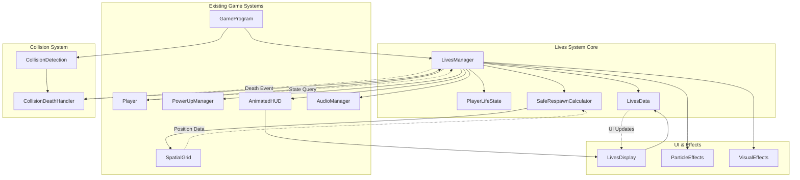
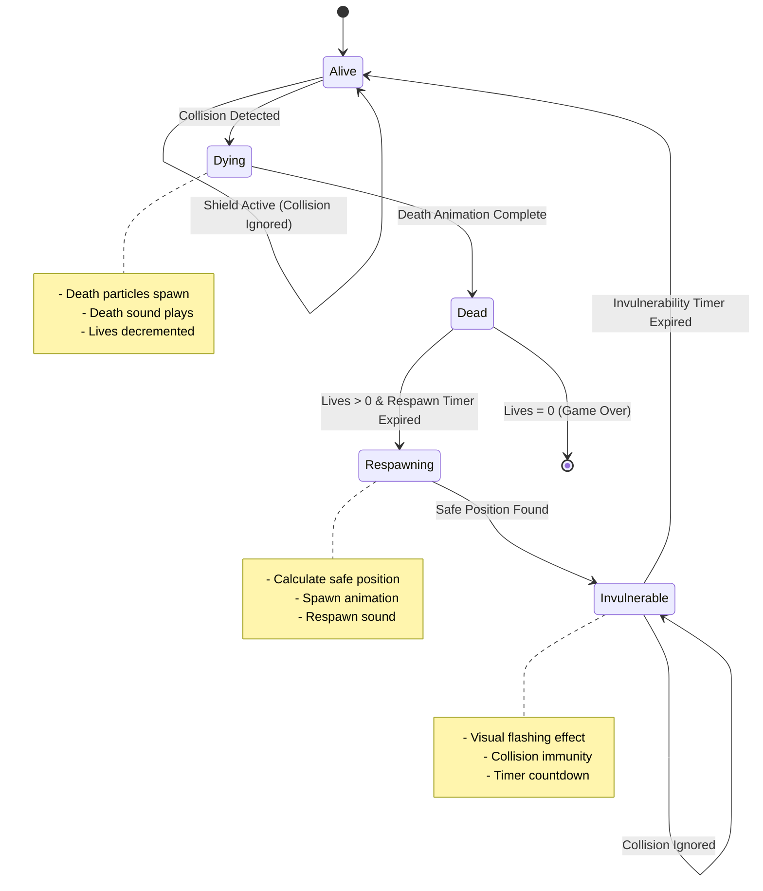
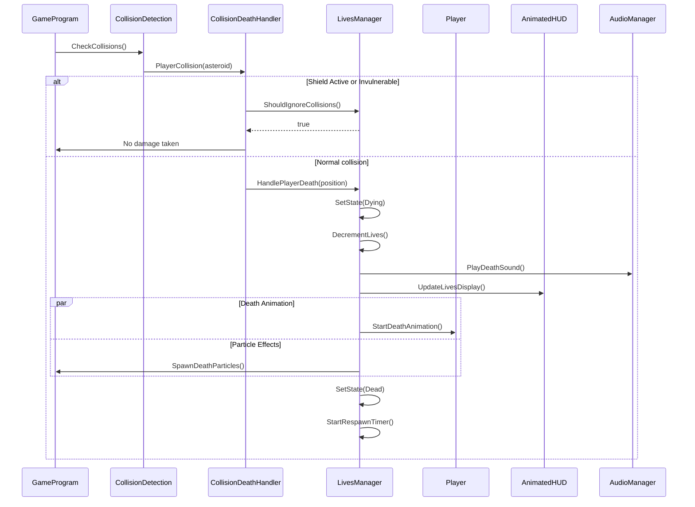
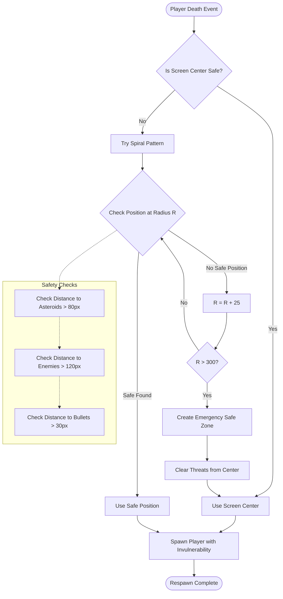
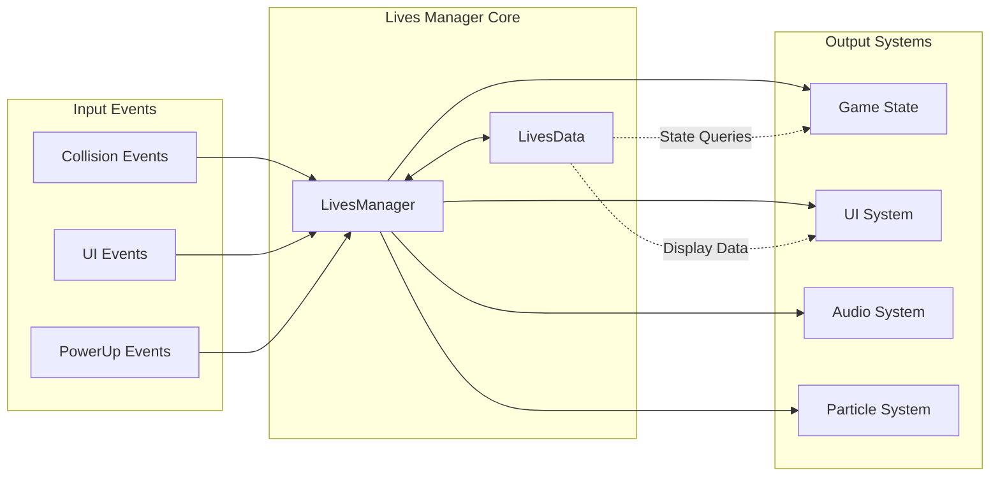
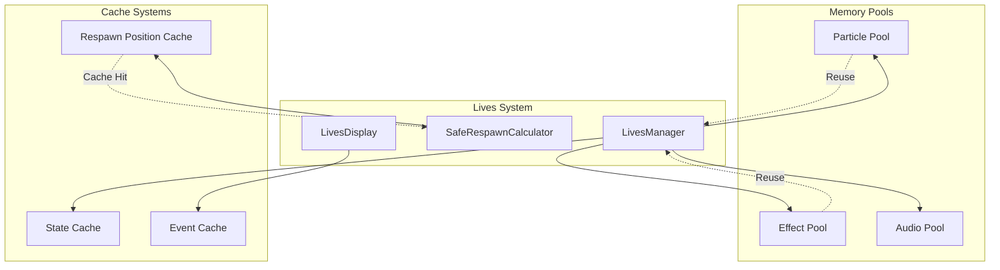

# Lives System Architecture Diagrams

## System Component Relationships

## State Transition Diagram

## Collision Integration Flow

## Respawn Position Algorithm Flow

## Data Flow Architecture

## Memory Management Architecture

## Integration Timeline

```mermaid
gantt
    title Lives System Implementation Timeline
    dateFormat X
    axisFormat %s
    
    section Phase 1: Foundation
    Data Models     :done, p1a, 0, 2h
    Core Enums      :done, p1b, after p1a, 1h
    
    section Phase 2: Core Logic
    Lives Manager   :active, p2a, after p1b, 3h
    State Management:p2b, after p2a, 1h
    
    section Phase 3: Respawn System
    Position Algorithm :p3a, after p2b, 2h
    Spatial Integration :p3b, after p3a, 2h
    Safety Validation :p3c, after p3b, 1h
    
    section Phase 4: Integration
    Collision System :p4a, after p3c, 2h
    Player Updates  :p4b, after p4a, 1h
    Shield Integration :p4c, after p4b, 1h
    
    section Phase 5: UI & Effects
    Lives Display   :p5a, after p4c, 1h
    Visual Effects  :p5b, after p5a, 1h
    Audio Integration :p5c, after p5b, 1h
    
    section Phase 6: Testing
    Unit Tests      :p6a, after p5c, 1h
    Integration Tests :p6b, after p6a, 1h
```

